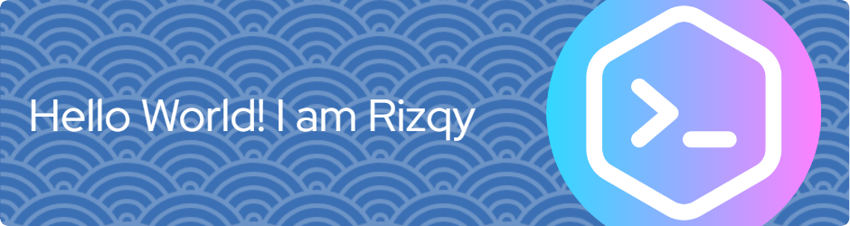

## Hi there 👋

- 🌱 I’m currently learning **Next.js**, **Machine Learning**,**Data Analitics**, and **Web Developer**
- 🧑‍🎓 i'm undergraduate **Computer Science** student in **Unimma**
- 😁😁😁

##### Skills

##### Connect with ME

##### My Github Stats

